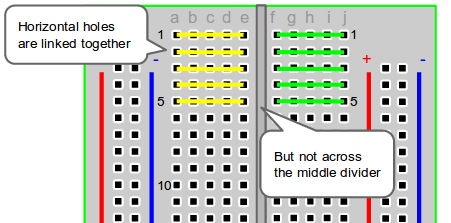

# Delta Week 2 / Task #1 - Using the Arduino IDE

Plug your ready-assembled arduino circuits into your PCs and observe what happens. Fun right? Press the button on the circuit for even more fun.

> ### **PLEASE DO NOT REMOVE ANY OF THE COMPONENTS FROM THE BREADBOARDS FOR THIS SESSION**.
Do so only if instructed by me.

### Key words 
 - *README* files - exactly what it means - "read me" - if you see a file called readme then you should read it...
 - *IDE* - Integrated Development Environment - you can think of it as a **text/code editor** that's so smart it can also compile your code and in our case even upload it to the device. Clever right?
 - *Sketch* - This is an arduino specific way of saying *Source code file* - this is where we will write code for the arduinos, in sketches

## Introduction (Optional - skip to the Goals section below if you don't want to read it)
Welcome back guys. Hope you had a decent half-term break. This week we will be hitting the road with the highly anticipated "programming of the arduino" part which I know you have all been itching to do. Due to the fact that I am required to quarantine until next Thursday means that I cannot be with you in person but Mr Rass has kindly set up the ICT room so I can help you remotely should you have difficulties with the software. 

Therefore this session will be more of a follow-the-instructions type of session where you will be reading throught the pages in each Task folder. Access these **README** worksheets from your internet browsers (Chrome or whatever else you usually use). DO NOT read them directly by downloading the files and opening them on your PCs as they won't be formatted properly and will look weird.

This is what I'll be doing now - I am providing you with instructions on how to use the code I have uploaded. In this specific case our first sketch (code file) is **Task1.ino**

In this session you will be provided with readily assembled circuits - I would normally let you build them by yourselves but due to my in-person absence this week I have prepared them ready for you. 

## Goals
In this task:
  - We will be getting familiar with the Arduino IDE (what's this? - check the key words section).
  - We will setup and upload our first sketch to the arduino to activate the Green LED.

## Session #1 Recap
Last week we had some fun learning a few basics about electricity and using that knowledge we powered some LEDs on our breadboards. Here is a quick recap:
  - Breadboards:
    
    

    

  - LEDs:
    - Light Emitting Diode
    - Longer leg is positive, shorter is negative; I have bent the positive legs with two 90&deg; angles so that it's easier to identify
    - They do not offer much resistance so they need a resistor in series with them
    
  - Resistors:
    - Limit the flow of electricity
    - we connect them in series between the input voltage line (+5V) and the positive leg of the LED - it acts as protection for the LED as mentioned already
    - they come in different values - the ones we use are about 220Ω (220 Ohms)
    
  - Short circuit:
    - Remember what happens if we connect the positive rail of a power source directly to the negative one *without resistance*? Recall the burning branches on the electricity pylons videos? That's what happens. That's why we need resistance - to limit the energy flowing between the two terminals.
    
## Let's begin
### Downloading the code files for today's session
Let's begin with the basic setup.
 - As the above title suggests we need the code files for today's session. In a new tab in your browser open this link: https://github.com/dant14/Delta-sessions
 - Now click on **`Code`>`Download Zip`** like this:

 - Save the zip folder somewhere in your Documents where you know where it is and can easily access it.
 - Unzip the folder. If you don't know how to unzip a folder just ask one of your techy friends to show you. Alternatively google it: https://bfy.tw/PdmP
 - Now go inside the folder into the Task1 folder and double click on Task1.ino. If it prompts you to choose the software to open it with just select **Arduino**
 
### Uploading your first Sketch
Congratulations. You have opened your first sketch.

 - Next we will click on the **Verify** button:
 

 - After a few seconds you should the following message at the bottom:
 
 
 
 This means the program was successfully built.
 
 - now we need to select the the correct COM port (aka USB port) so that the program knows where to upload our sketch:
 
 
 
 *Note that your COM port may have a different number.*
 
 - next we need to select the correct board - Arduino Nano:
 
 
 
 Now you are ready to upload!
 
 Hit the upload button:
 
 
 
 And you should get an upload success message:
 
 
 
 
 The green LED shouhld light up. If that happens then:
 
 ## Well done!!
 You have successfully programmed your first microcontroller! Take a moment to appreciate how awesome you are.
 
 Before you go to Task 2 have a little look at the code inside the Arduino sketch that you just uploaded. Can you figure out what it does?
 
 [To Task #2](https://github.com/dant14/Delta-sessions/tree/main/Week2/Task2)
