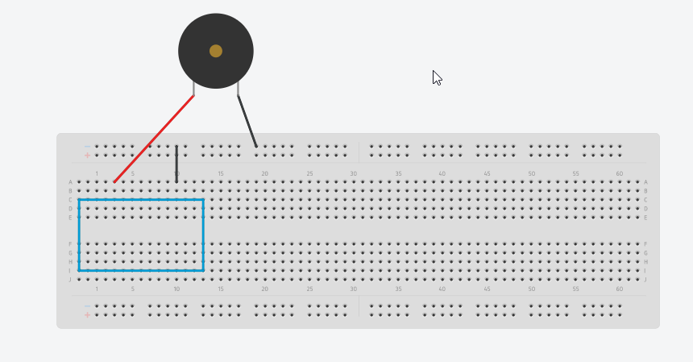

# Delta Week 3 / Task #1 - Make the Arduino say "hello" over serial and...(drum roll)..."THE BUZZER"

Welcome to week 3 Electronics.

Today we are going to learn how to use ultrasonic sensors to measure distance and make some noise with Arduino. Here we go...

## Task #1 Goals

We will now see what it means to recive data in a readable format back from the Arduino and read it on our PCs.

Oh yeah and we'll also do some buzzing. Betcha you can't wait

## Instructions

### Serial communication test

- Open Arduino on your PC

- Take a breadboard with an Arduino on it from me at the start of your session.

- Plug your Arduino board into the USB of your PC

- On your PC, delete ALL the contents of the Arduino file that you just opened and paste the contents of the Task1.ino sketch from this folder.

- Check you are connected to the correct COM port (Tools>Port:) and upload the sketch.

- Open the serial monitor - it is the small icon at the top right of the Arduino program - it should open a new "console window" where you should see a message from the Arduino

- What is the message?

- Try changing the text or adding more and see if you can get it back on the "console window". *Hint: see line 23, 25 and 27 - change and/or duplicate any of those on a new line with a copy and paste*

### Make it buzz

- Unplug the Arduino from the PC.

- Use the jumpers to connect the GND pin on the Arduino to the blue power line running down the side of the breadboard (to make it a negative power rail - remember week 1)

- use another jumper to connect the negative (-) leg of the buzzer to the negative power rail on the breadboard.

- use another jumper to connect the positive (+) leg of the buzzer to pin 8 of the Arduino.

If you are struggling with the steps above look at this schematic below: (blue box represents the Arduino)

- Plug it back in and open the serial monitor again.

Can you hear anything? If not check you haven't reversed the buzzer pin connections. Happens very often.

### Play around with it!

Try the following scenarios:

- Change the 2 parameters in the `beep` function
  - the first one - `700` is the pitch of the tone; valid ranges for this number are **100 - 16000** so anything between these two numbers;
  - the second one - `300` is the duration of the beep - the bigger the number, the longer the beep; recomended ranges: **50 - 5000**
  
- Make it beep more than once. *Hint: copy and paste the `beep` function on a new line directly after the last delay*

[To Task #2](https://github.com/dant14/Delta-sessions/tree/main/Week3/Task2)
