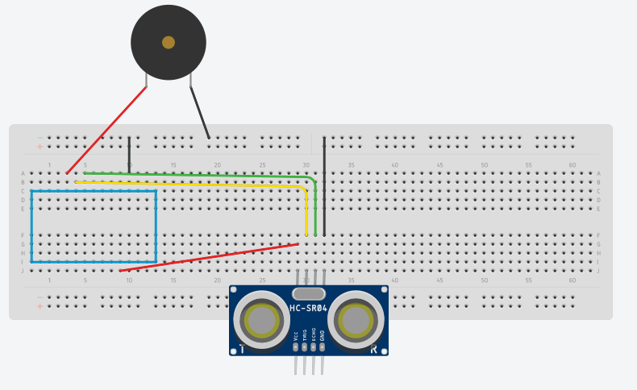

# Delta Week 3 / Task #2 - Use an ULTRASONIC DEVICE to measure stuff

## Task #2 Goals

We are going to --read the title-- ^

But first, have a look around and check if your mates have reached this point and if anyone is behind, go and share your knowledge with them and help them out.

Only then are you allowed to continue.

## Instructions

### Hookup

- Try and connect up the following schematic (leave the buzzer connections the same as the previous task):

If you aren't sure which pins are which here are the connections:

| Ultrasonic sensor pins | Arduino pins |
|------------------------|--------------|
| VCC  ->                | +5V          |
| Trig ->                | D7           |
| Echo ->                | D6           |
| GND  ->                | GND          |

### Reading the sensor

- Delete **ALL** code from your Arduino window then copy and paste the contents of the Task2.ino into your sketch.

- Verify and upload the sketch to your device.

- Open the serial monitor. Can you see measurements? If not then check your connections to the sensor are correct and that you have uploaded correctly.

### Play around with it!

Grab a ruler and find out how accurate the sensor is.

[To Task #3](https://github.com/dant14/Delta-sessions/tree/main/Week3/Task3)
