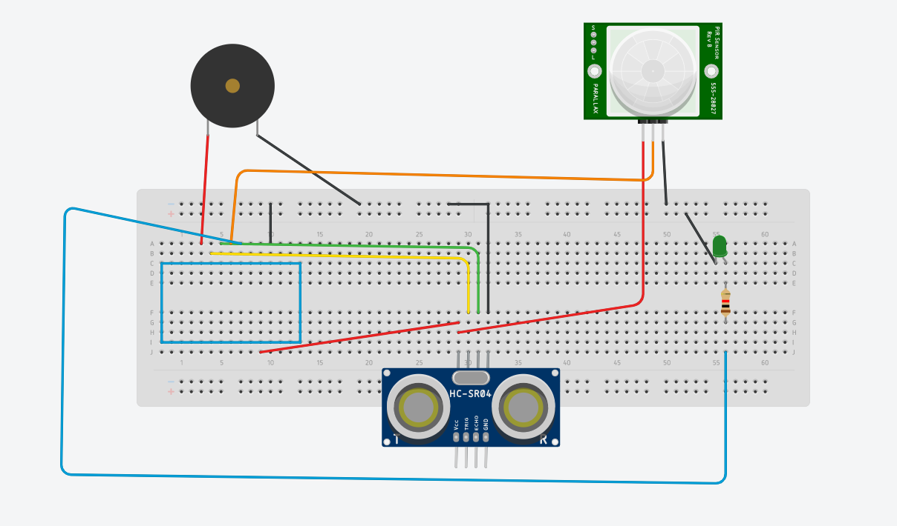

# Delta Week 3 / Task #3 - OPTIONAL Have a go with activating an LED with a PIR Motion sensor

## Task #3 Goals

We are going to --read the title-- ^

But first, have a look around and check if your mates have been successful and if anyone is behind, go and share your knowledge with them and help them out.

Only then are you allowed to continue.

## Instructions

This one is optional so if you're feeling adventurous go for it. Code is provided in the sketch file in this folder.

### Hookup
Connections as follows: (refer to image below)
 - Red pin    ->  +5V arduino pin
 - Orange pin ->  D5 arduino pin
 - Black pin  ->  GND
 - LED positive leg -> D4 (with resistor between)
 - LED negative leg -> GND
 

This will demonstrate how a motion sensor works - move in front of it and see the LED light up for a few seconds!

[To Task #4](https://github.com/dant14/Delta-sessions/tree/main/Week3/Task4_STAR_WARS_PARTY)
