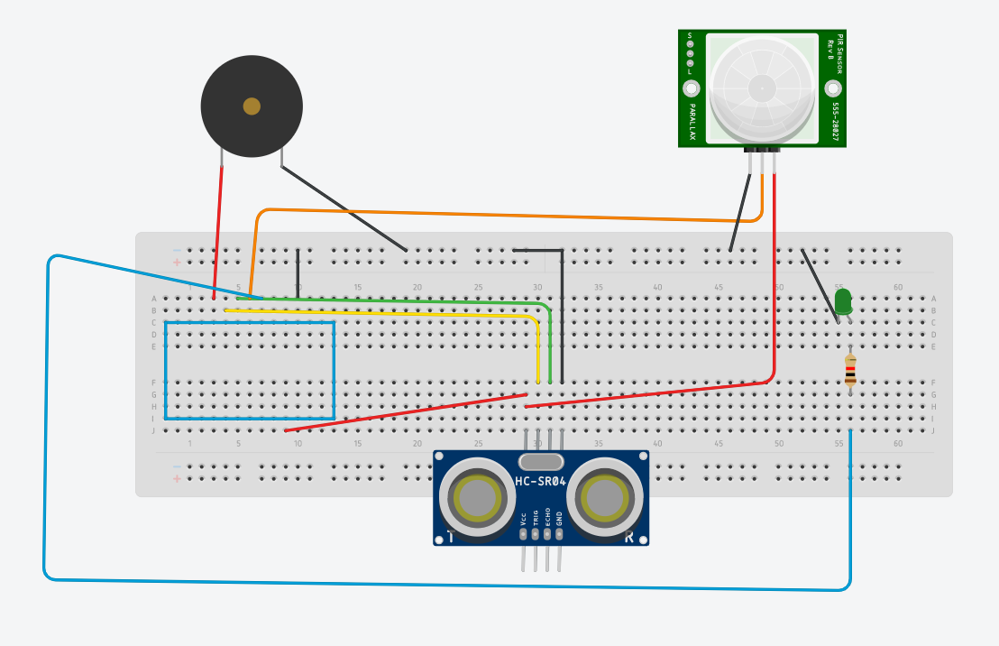

# Delta Week 3 / Task #3 - OPTIONAL Have a go with activating an LED with a PIR Motion sensor

## Task #3 Goals

We are going to --read the title-- ^

But first, have a look around and check if your mates have been successful and if anyone is behind, go and share your knowledge with them and help them out.

Only then are you allowed to continue.

## Instructions

This one is optional so if you're feeling adventurous go for it. Code is provided in the sketch file in this folder.

### The PIR motion sensor

So this lil guy is a very basic motion sensor. PIR stands for Passive InfraRed which simply means it can detect infrared light emmitted from most objects.

Simply put, all objects emit various waves and this sensor can pick up the infrared ones, so every time there is movement in front of it it will trigger a positive signal from it's Signal Pin because there were some infrared beams that came it's way.

To make it work you need to connect the power (+5V and GND) as well as the signal line - in total only 3 connections. Details below.

### Hookup
Connections as follows: (refer to image below)
 - Red pin    ->  +5V arduino pin
 - Orange pin ->  D5 arduino pin
 - Black pin  ->  GND
 - LED positive leg -> D4 (with resistor between)
 - LED negative leg -> GND
 

This will demonstrate how a motion sensor works - move in front of it and see the LED light up for a few seconds!

[To Task #4](https://github.com/dant14/Delta-sessions/tree/main/Week3/Task4_STAR_WARS_PARTY)
